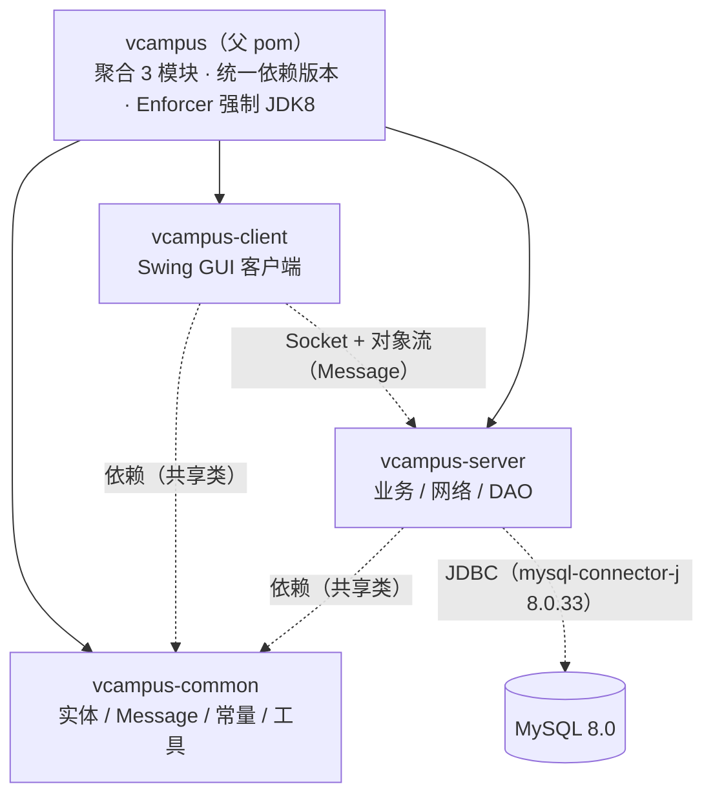
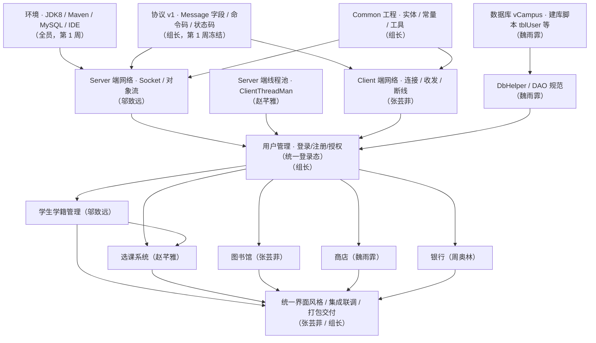
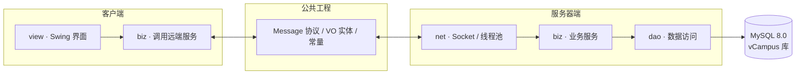

# vCampus 项目依赖拓扑与四周开发规划

> 配套文档：技术栈见 `README.md`，架构决策见 `docs/adr/`，分工见 `docs/roles.md`。

---

## 一、项目依赖拓扑

### 1.1 模块依赖关系

### 1.2 开发依赖拓扑（必须先开发/敲定者在顶层）

> 规则：**上层必须先开发/敲定，下层才能开工**。协议 v1、Common、数据库 schema 与环境是全局地基，须第 1 周冻结；网络与 DAO 依赖它们；用户管理（登录态）是所有业务模块的公共前置；业务模块之间再按依赖次序推进；界面与打包交付在最后。

**开发/敲定顺序表**

| 层级       | 内容                                     | 前置    | 负责人                            |
| ---------- | ---------------------------------------- | ------- | --------------------------------- |
| 0 地基     | 环境、协议 v1、Common、建库脚本          | —       | 全员 / 组长 / 魏雨霏              |
| 1 基础设施 | Server/Client 网络、线程池、DbHelper/DAO | 0       | 邬致远 / 赵芊雅 / 张芸菲 / 魏雨霏 |
| 2 认证     | 用户管理（统一登录态）                   | 0、1    | 组长                              |
| 3 业务模块 | 学籍 / 选课 / 图书馆 / 商店 / 银行       | 0、1、2 | 各负责人                          |
| 4 交付     | 界面统一、集成联调、打包                 | 0--3    | 张芸菲 / 组长                     |

---

### 1.3 分层调用拓扑（view → biz → vo → dao）

> 客户端与服务器端通过 `vcampus-common` 共享同一份 `Message`/实体类，保证序列化一致性（ADR-0006）。

### 1.4 外部依赖清单

| 依赖/组件                            | 版本                                            | 用途                                                    | 作用域    |
| ------------------------------------ | ----------------------------------------------- | ------------------------------------------------------- | --------- |
| JDK                                  | 8（编译工具链）/ 21（IDE 运行时）               | 编译出**1.7 字节码**（ADR-0001）                        | 构建/开发 |
| Maven                                | 3.9.x                                           | 构建与依赖管理                                          | 构建      |
| junit-jupiter                        | 5.10.2                                          | 单元 / 集成测试                                         | test      |
| mockito-core                         | 4.11.0                                          | 测试隔离（mock 网络/数据库）                            | test      |
| mysql-connector-j                    | 8.0.33                                          | JDBC 连接 MySQL                                         | compile   |
| maven-compiler-plugin                | 3.13.0                                          | 编译（source/target 1.7）                               | build     |
| maven-surefire-plugin                | 3.2.5                                           | 执行 JUnit 5 测试                                       | build     |
| maven-shade-plugin                   | 3.5.1                                           | 打可执行 jar（`vCampusClient.jar`/`vCampusServer.jar`） | build     |
| maven-enforcer-plugin                | 3.4.1                                           | 强制 JDK 8 + Maven 版本                                 | build     |
| jacoco-maven-plugin                  | 0.8.11                                          | 覆盖率报告（不作门禁）                                  | build     |
| maven-checkstyle-plugin / checkstyle | 3.3.1 / 9.3                                     | 注释与编码规范检查                                      | build     |
| GitHub Actions                       | setup-java(temurin8) · mysql:8.0 · setup-python | CI 3 状态检查                                           | CI        |

---

## 二、四周开发规划（TDD 驱动）

> 横切公共设施先行：**协议 v1（Message/命令码）须在第 1 周冻结**，其余模块基于其上并行开发（ADR-0006）。
> 每个功能按 **红（失败测试）→ 绿（最小实现）→ 重构** 开发，经 PR + 3 状态检查合入 `main`。

### 第 1 周 · 环境与地基

| 事项                                            | 负责人        | 产出/验收                                  |
| ----------------------------------------------- | ------------- | ------------------------------------------ |
| 每人安装环境（JDK8/Maven/IDE/MySQL）            | 全员          | `java -version`(1.8) / `mvn -version` 通过 |
| 冻结通信协议 v1（Message 字段、命令码、状态码） | 组长          | ADR-0006 落实、Common 骨架                 |
| Server 端网络骨架（Socket 监听、对象流收发）    | 邬致远        | 单元测试 + 本机 socket 对测                |
| Server 端线程池骨架（ClientThreadMan）          | 赵芊雅        | 多客户端并发测试                           |
| Client 端网络骨架 + 主窗口/登录界面             | 张芸菲        | 界面原型 + Client 收发测试                 |
| 数据库建表（tblUser 等）+ DbHelper              | 魏雨霏        | `sql/vCampus.sql` + 建库脚本可执行         |
| 用户管理基础（登录/注册/登出）                  | 组长          | 登录/注册通过集成测试                      |
| 设计说明书 / 分工表初稿                         | 周奥林 / 组长 | **第 1 周周一提交**                        |

### 第 2 周 · 纵向模块并行开发

| 事项                             | 负责人       | 产出/验收           |
| -------------------------------- | ------------ | ------------------- |
| 学籍管理（增删改查）             | 邬致远       | DAO 集成测试 + 界面 |
| 选课系统（选/退课、成绩）        | 赵芊雅       | 业务逻辑测试 + 界面 |
| 图书馆（检索/借还）              | 张芸菲       | 业务 + 界面         |
| 商店（商品/购买）                | 魏雨霏       | 业务 + 界面         |
| 银行（余额/充值/流水）           | 周奥林       | 业务 + 界面         |
| 统一界面风格与公共组件           | 张芸菲       | 界面规范落地        |
| 各模块 DAO 接入 MySQL + 集成测试 | 各模块主责人 | 每模块集成测试通过  |

> 每周二提交进度计划报告。

### 第 3 周 · 集成与联调

| 事项               | 说明                                        |
| ------------------ | ------------------------------------------- |
| 登录态统一         | 各模块接入统一登录/权限（组长提供授权接口） |
| 模块间数据依赖打通 | 选课↔学籍、商店↔银行余额等                  |
| 跨模块接口 review  | 组长 + 网络三人组审协议边界                 |
| GUI 完善与美化     | 张芸菲统筹，各模块配合                      |
| 补全集成/边界测试  | 全员，CI 覆盖率报告作参考                   |

### 第 4 周 · 收尾与交付

| 事项                    | 说明                                       |
| ----------------------- | ------------------------------------------ |
| 打包验证                | `mvn package` 产出两个可执行 jar，运行冒烟 |
| 数据库测试数据完善      | 魏雨霏，`sql/vCampus.sql` 最终版           |
| 系统使用说明            | 周奥林                                     |
| Javadoc HTML 生成       | 全员确保 Javadoc 完整（CI 强制）           |
| 小组项目报告 / 个人小结 | 周奥林 / 全员                              |
| 组内/组间互评表         | 全员                                       |
| 演示排练与答辩          | 组长统筹，第 4 周周五答辩                  |

> 第 4 周周五提交全部交付物：可执行 jar、数据库脚本、系统使用说明、源代码、Javadoc HTML、小组项目报告、个人小结、互评表。

### 分工速查

| 成员           | 纵向模块     | 横切职责                                      |
| -------------- | ------------ | --------------------------------------------- |
| 李文湖（组长） | 用户管理     | 系统设计、协议/Common 审核、CI/仓库、打包部署 |
| 邬致远         | 学生学籍管理 | Server 端网络                                 |
| 赵芊雅         | 选课系统     | Server 端多线程池                             |
| 张芸菲         | 图书馆       | Client 端网络、界面设计                       |
| 魏雨霏         | 商店         | 数据库设计（DbHelper/建库/DAO 规范）          |
| 周奥林         | 银行（选做） | 文档编写、测试部署辅助                        |
